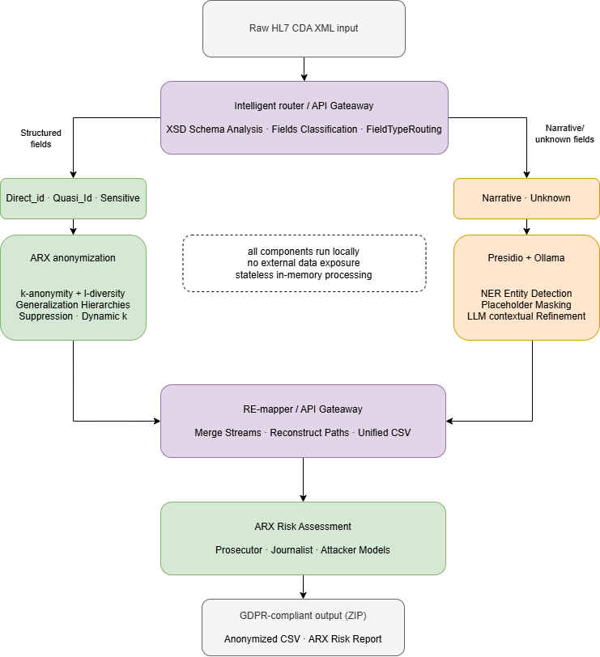

# GDPR‑Compliant Anonymization of HL7 CDA Health Data in Estonia

### A Hybrid Approach Using ARX and AI‑Based De‑identification

## Overview

This project implements a hybrid anonymization pipeline for ```HL7 CDA``` health documents, combining:

```ARX``` structured‑data anonymization (k‑anonymity, l‑diversity, t‑closeness)  
```Presidio``` AI‑based PII detection for narrative text  
```Schema‑aware CDA processing``` routes structured and unstructured content to the correct anonymizer


The system is designed to support ```GDPR‑compliant de‑identification``` of Estonian``` HL7 CDA``` documents (HL7‑EE‑DL‑Ext).


## Tech Stack

### Customer Gateway
```Spring Boot 4.0.5```
```Java 25```
```Gradle```

### ARX Anonymization Service
```Spring Boot 3.5.10```
```Java 21```
```Maven```
```ARX 3.9.2```

### Frontend
```Vue 3```
```Vite```

### Presidio Integration
Presidio must be added manually from the official repository:  
https://github.com/microsoft/presidio

## Architecture Overview
### CDA XML:


## Thesis
GDPR‑Compliant Anonymization of HL7 CDA Health Data in Estonia:  A Hybrid Approach Using ARX and AI‑Based De‑identification


